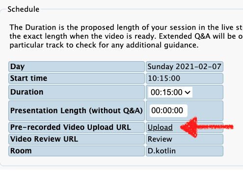

# Kotlin DevRoom @ FOSDEM 21 - Speakers Recording Guide

Hey all,
Thanks for taking the time to participate at the Kotlin DevRoom @ FOSDEM 2021.

> Please note that this is a working document. We're still getting information from FOSDEM and we will update this file with the latest information available.

- [Where is my talk?](#where-is-my-talk)
- [How long is my talk?](#how-long-is-my-talk)
  - [Example](#example)
- [How to pre-record your talk](#how-to-pre-record-your-talk)
  - [Recording deadline](#recording-deadline)
- [How to upload the video?](#how-to-upload-the-video)
- [How to live Q&A](#how-to-live-qa)
  - [Question: is this approach for both Formal & Informal Q&A?](#question-is-this-approach-for-both-formal--informal-qa)
- [Glossary](#glossary)

## Where is my talk?

All the talks are listed in the Kotlin DevRoom Page:

[https://fosdem.org/2021/schedule/track/kotlin/](https://fosdem.org/2021/schedule/track/kotlin/)

Please make sure the information on the talks and the speakers you entered are correct.

All the times are displayed in **Central European Time (Europe/Brussels)** timezone.

## How long is my talk?

A presentation consists of 2 or 3 parts:
- Talk - this is the **pre-recorded** portion of your talk.
- Formal Q&A - this is the **live** Q&A session that happens after the pre-recorded part is finished.
- Informal Q&A - this is an **optional** continuation of the Formal Q&A, that happens in a different room when the time is up.

There are 2 important fields in **pentabarf** regarding the duration of the talk:

- Duration - this is the total length of the allotted time slot(**Talk + Formal Q&A**). This field has been set by us, devroom organizers according to your original request.
- Presentation Length (without Q&A) - well, this is basically the length of the **Talk** portion (i.e. the duration of the file you upload once processed).

You're **not** supposed to edit those two fields. 

### Example
- Start time = 11:00 AM
- Duration = 30 minutes
- Presentation Length = 22 minutes

This means:
- at exactly 11:00 AM the pre-recorded video will start playing
- at 12:22:30 the stream will switch over to the live feed with the speaker & moderator/host for the **Formal Q&A**
- at 12:30 the speaker & audience will get a chance to switch to a different channel to continue the discussion(**Informal Q&A**), before the next pre-recorded video will start playing

## How to pre-record your talk
    sources:
    - https://github.com/FOSDEM/video/wiki/FOSDEM-2021-video-email-to-speakers
    - https://lists.fosdem.org/private/devroom-managers/2021-January/002214.html
    - https://otl.du.edu/knowledgebase/using-zoom-to-record-a-video-presentation/
    - https://lists.fosdem.org/private/devroom-managers/2021-January/002239.html <-- thanks Collab devroom!
There are currently 2 ways to record the talks:

- Record by yourself (**recommended**) - meaning you as speaker are free to choose whatever software or green screen or what not to make the talk as fancy as possible.
  - The recommendation is to use [OBS](https://obsproject.com/download) and have a layout with your slides and   
  - If you wish, we can arrange to have a host to be present for this as well (four eyes principal)
  
- Conference call record - we would set up a call with one of the moderators/hosts, and record the online presentation. 

Your video should adhere to the following technical requirements provided by FOSDEM: [FOSDEM/video/wiki/FOSDEM-2021-video-email-to-speakers](https://github.com/FOSDEM/video/wiki/FOSDEM-2021-video-email-to-speakers).

```groovy
resolution: 1280x720
frame rate: 25 fps
video codec: h264 video codec, main profile
video bitrate: <= 2Mbit/s
audio codec: aac audio codec
audio sample rate: 48 KHz mono
audio bitrate: 128 Kbit/s
media container: mp4
```

This [video tutorial](https://peertube.xwiki.com/videos/watch/c5cf50e3-2277-440a-b339-34874acd00b3) will show you how to setup OBS to **meet those requirements**.

<iframe width="560" height="315" sandbox="allow-same-origin allow-scripts allow-popups" src="https://peertube.xwiki.com/videos/embed/c5cf50e3-2277-440a-b339-34874acd00b3" frameborder="0" allowfullscreen></iframe>

### Recording deadline

We haven't heard about the official deadline yet, but for the time being **January 15th 2021** will serve as our deadline.

Please make sure that a first version of your talk is uploaded by that time. This will give us time to review and eventually run a second shoot if needed.

## How to upload the video?

Visit [penta.fosdem.org/submission](http://penta.fosdem.org/submission) and login with your pentabarf account. Click on "Events" on the navigation bar and open your event.

You should see the following form in the "Schedule" section:



You can click on the **Upload Link URL** to upload your talk.
Please note that the file limit is **1 GB**.

Once uploaded, the processing will start (could take more than an hour).
When the processing ends, the "presentation length" field gets filled in with the video length (so don't change this yourselves once it's been set) and a **Review link** will appear to let you check the video and make changes. 

## How to live Q&A
    
The live Q&A will start with a Matrix chatroom during the talk, with the option to answer questions in the chat of course. And continues live with Jitsi after the talk is finished.

What you will need is:
- Matrix account & client - for more info see https://matrix.org/blog/2021/01/04/taking-fosdem-online-via-matrix
- Jitsi - They have some native clients, but [the web client](https://meet.jit.si/) works just fine.

#### Question: is this approach for both Formal & Informal Q&A?

The working assumption is yes, but we will add more details once they are known.

## Glossary

`Moderators`, `Hosts`, `Devroom mods`, `Speaker Hosts`: basically somebody from the devroom team or volunteers that would help set up calls, and also help organize the live Formal Q&A chatrooms and video feeds.

### Contact us

Make sure you join the [#fosdem](https://kotlinlang.slack.com/archives/CNL8G48LA) on the KotlinLang Slack. You can get an [invite here](https://surveys.jetbrains.com/s3/kotlin-slack-sign-up?_ga=2.95459420.1713471603.1609964350-2073091625.1579276168).

- [Nicola Corti](https://github.com/cortinico)
- [Martin Bonnin](https://github.com/martinbonnin)

