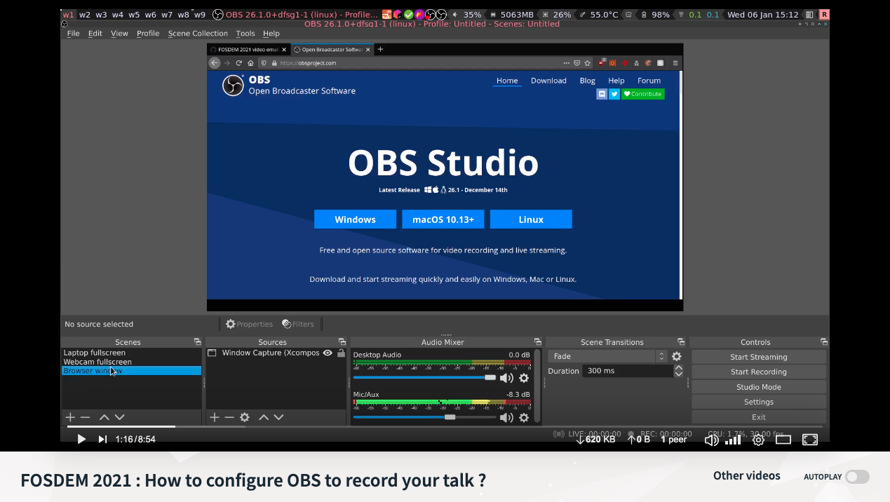

# Kotlin DevRoom @ FOSDEM 22 - Speakers Recording Guide

Hey all,
Thanks for taking the time to participate at the Kotlin DevRoom @ FOSDEM 2022.

This guide is an customized version of the [FOSDEM Speakers Guide](https://fosdem.org/2022/manuals/program/speaker/) that you can find on the official website. The content is essentially the same, but we've added some Kotlin specific links and contact names.

- [Where is my talk?](#where-is-my-talk)
- [How long is my talk?](#how-long-is-my-talk)
  - [Example](#example)
- [How to pre-record your talk](#how-to-pre-record-your-talk)
  - [Recording deadline](#recording-deadline)
  - [Question: is my video going to be framed?](#question-is-my-video-going-to-be-framed)
- [How to upload the video?](#how-to-upload-the-video)
- [How to live Q&A](#how-to-live-qa)
  - [Question: is this approach for both Formal & Informal Q&A?](#question-is-this-approach-for-both-formal--informal-qa)
- [Glossary](#glossary)
- [Contact Us](#contact-us)
- [Acknowledgment](#acknowledgment)

## Where is my talk?

All the talks are listed in the Kotlin DevRoom Page:

[https://fosdem.org/2022/schedule/track/kotlin/](https://fosdem.org/2022/schedule/track/kotlin/)

Please make sure the information on the talks and the speakers you entered are correct.

All the times are displayed in **Central European Time (Europe/Brussels)** timezone.

## How long is my talk?

A presentation consists of 2 or 3 parts:
- Talk - this is the **pre-recorded** portion of your talk.
- Formal Q&A - this is the **live** Q&A session that happens after the pre-recorded part is finished.
- Informal Q&A - this is an **optional** continuation of the Formal Q&A, that happens in a different room when the time is up.

There are 2 important fields in **pentabarf** regarding the duration of the talk:

- Duration - this is the total length of the allotted time slot(**Talk + Formal Q&A**). This field has been set by us, devroom organizers according to your original request.
- Presentation Length (without Q&A) - well, this is basically the length of the **Talk** portion (i.e. the duration of the file you upload once processed).

You're **not** supposed to edit those two fields. 

### Example
- Start time = 11:00 AM
- Duration = 30 minutes
- Presentation Length = 22 minutes

This means:
- at exactly 11:00 AM the pre-recorded video will start playing
- at 11:22:30 the stream will switch over to the live feed with the speaker & moderator/host for the **Formal Q&A**
- at 11:30 the speaker & audience will get a chance to switch to a different channel to continue the discussion (**Informal Q&A**), before the next pre-recorded video will start playing

## How to pre-record your talk

There are currently 2 ways to record the talks:

- Record by yourself (**recommended**) - meaning you as speaker are free to choose whatever software or green screen or what not to make the talk as fancy as possible.
  - The recommendation is to use [OBS](https://obsproject.com/download) and have a layout with your slides and   
  - If you wish, we can arrange to have a host to be present for this as well (four eyes principal)
  
- Conference call record - we would set up a call with one of the moderators/hosts, and record the online presentation. 

Your video should adhere to the following technical requirements provided by FOSDEM:

```
resolution: 1280x720
frame rate: 25
fps video codec: h264 video codec, main profile
video bitrate: aim for 2Mbit/s
audio codec: aac audio codec
audio sample rate: 48 KHz mono
audio bitrate: 128 Kbit/s
media container: whatever is easiest for you (mp4 suggested)
maximum size of 2 GB
```

This [video tutorial](https://peertube.xwiki.com/videos/watch/c5cf50e3-2277-440a-b339-34874acd00b3) will show you how to setup OBS to **meet those requirements**.

<p align="center">
  <a href="https://peertube.xwiki.com/videos/watch/c5cf50e3-2277-440a-b339-34874acd00b3"></a>
</p>

### Recording deadline

Please note that the recording deadline is: **January 21st 2022**.

Please make sure that a first version of your talk is uploaded by that time. This will give us time to review and eventually run a second shoot if needed.

### Question: is my video going to be framed?

Speakers asked if the video is going to be recomposed with a FOSDEM specific frame or an overlay logo. The answer is: **no**, the video will be shown as it is. However intro slide(s) may be shown before/after the submitted video.  

## How to upload the video?

Visit [penta.fosdem.org/submission](http://penta.fosdem.org/submission) and login with your pentabarf account. Click on "Events" on the navigation bar and open your event.

You should see the following form in the "Schedule" section:


You can click on the **Upload Link URL** to upload your talk.
Please note that the file limit is **2 GB**.

When you upload your video, the system will verify that it meets these requirements listed above.
If it does not, the video will be transcoded first (but this will take longer, potentially even more than an hour).

When the processing ends, the "presentation length" field gets filled in with the video length (so don't change this yourselves once it's been set) and a **Review link** will appear to let you check the video and make changes. 

**You can find a video tutorial on [how to upload the recording here](https://www.flickr.com/photos/runningwithbulls/50829935862/in/dateposted/)**

## How to live Q&A
    
The live Q&A will start with a Matrix chatroom during the talk, with the option to answer questions in the chat of course while the video plays. 

When the video completes, the live stream will automatically switch over to a live video room with the speaker and speaker host. The speaker host will lead a live Q&A/discussion (the **Formal Q&A**) on video, asking questions that have been upvoted in the text chat or asking questions of their own, clarifying anything that may not have been clear.

Just before the close of the live Q&A, the live stream will end and if any of the audience want to continue the Q&A/discussion, they will be **redirected** to the right place to go do that. You can then continue with your **Informal Q&A** in a more open, informal fashion than during the session itself.

What you will need is:
- Matrix account & client - for more info see https://matrix.org/blog/2021/01/04/taking-fosdem-online-via-matrix
- Jitsi - They have some native clients, but [the web client](https://meet.jit.si/) works just fine.

### Question: is this approach for both Formal & Informal Q&A?

Yes, we are going to use the same software for both.

## Glossary

`Moderators`, `Hosts`, `Devroom mods`, `Speaker Hosts`: basically somebody from the devroom team or volunteers that would help set up calls, and also help organize the live Formal Q&A chatrooms and video feeds.

## Contact us

Make sure you join the [#fosdem](https://kotlinlang.slack.com/archives/CNL8G48LA) on the KotlinLang Slack. You can get an [invite here](https://surveys.jetbrains.com/s3/kotlin-slack-sign-up?_gl=1*1lo0i98*_ga*NTM4NzQ5MjUuMTYzODM3ODEwNA..*_ga_J6T75801PF*MTY0MjA5Njk3NS42LjAuMTY0MjA5Njk3NS4w).

- [Nicola Corti](https://github.com/cortinico)
- [Martin Bonnin](https://github.com/martinbonnin)
- [Marco Gomiero](https://github.com/prof18)
- [Julien Salvi](https://github.com/Oleur)
- [Holger Steinhauer](https://twitter.com/hfsteinhauer)

## Acknowledgment

- The Emulator DevRoom 2021 where this guide [was forked from](https://github.com/blackbeard334/fosdem21-emulator-devroom-cfp).
- The Collab DevRoom for creating the [video tutorial](https://peertube.xwiki.com/videos/watch/c5cf50e3-2277-440a-b339-34874acd00b3) we linked.
- JetBrains for sponsoring the DevRoom
